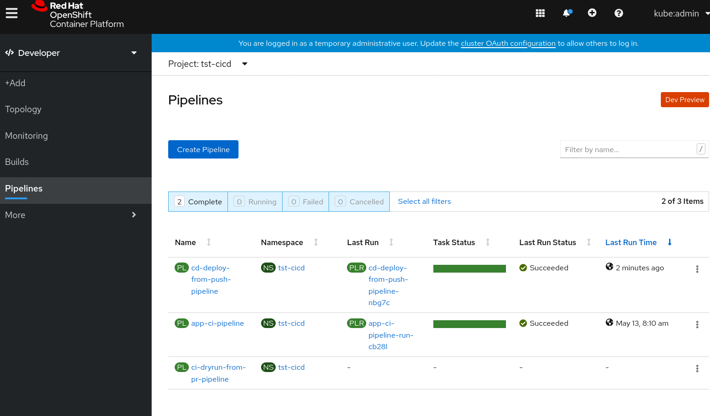
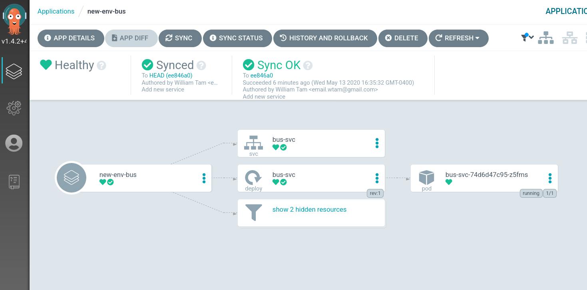

# Day 2 Operations

Day 2 Operations are actions that users take to  change a GitOps system. 
Currently, the following odo commands are available to allow users to add new
Evnrionments and Applications/Services.

* [odo pipelines environment](../../commands/environment)
* [oad pipelines service](../../commands/service)
* [oad pipelines webhook](../../commands/webhook)


## Prerequisites

* A GitOps system that was bootstrapped in [Day 1 Operations](../day1)
* A new soruce Git repository
* Download unofficial [odo](../../commands/bin) binary

## Create a new Environment

```shell
$ odo pipelines environment add \
  --env-name new-env
```

The above command adds a new Environment `new-env` in the Pipelines Model.

```yaml
environments:
- name: new-env
```

It generates the following yamls.  The new resources are namespace and role bindings.

* [`environments/<env-name>/env/base/<env-name>-environment.yaml`](output/environments/new-env/env/base/new-env-environment.yaml)
* [`environments/<env-name>/env/base/<env-name>-rolebindings.yaml`](output/environments/new-env/env/base/new-env-rolebindgs.yaml)

## Create an Application/Service in the new Environment

```shell
$ odo pipelines service add \
  --env-name new-env \
  --app-name bus \
  --service-name bus-svc \
  --git-repo-url http://github.com/<user>/bus.git \
  --webhook-secret testing 
```

**NOTE**: DO NOT use `testing` as your secrets.

Per the (GitHub documentation)[https://developer.github.com/webhooks/securing/]
you should generate a secret for each of them:

```shell
$ ruby -rsecurerandom -e 'puts SecureRandom.hex(20)'
```

The above command adds a new Service and Application under new-env in the Pipelines Model.

```yaml
environments:
- apps:
  - name: bus
    services:
    - bus-svc
  name: new-env
  services:
  - name: bus-svc
    source_url: http://github.com/<user>/bus.git
    webhook:
      secret:
        name: github-webhook-secret-bus-svc
        namespace: tst-cicd
```

In the Application's folder, a kustomization.yaml is generated to reference the Service we created.

* [`environments/new-env/apps/bus/base/kustomization.yaml`](output/environments/new-env/apps/bus/base/kustomization.yaml)

In the Service's folder, an empty `config` folder is ccreated.   This is the folder to add deployment yaml files to specify how the Service should be deployed.

* [`environments/new-env/services/bus-svc/base`](output/environments/new-env/services/bus-svc/base)

In this exxmple, We will just deploy a dummy nginxinc image and add the following files into `config` folder.

* `100-deployment.yaml`

```yaml
apiVersion: apps/v1
kind: Deployment
metadata:
  creationTimestamp: null
  name: bus-svc
  namespace: new-env
spec:
  replicas: 1
  selector:
    matchLabels:
      app.kubernetes.io/name: bus-svc
  strategy: {}
  template:
    metadata:
      creationTimestamp: null
      labels:
        app.kubernetes.io/name: bus-svc
    spec:
      containers:
      - image: nginxinc/nginx-unprivileged:latest
        imagePullPolicy: Always
        name: bus-svc
        ports:
        - containerPort: 8080
        resources: {}
      serviceAccountName: default
status: {}
```

* `200-service.yaml`
```yaml

apiVersion: v1
kind: Service
metadata:
  creationTimestamp: null
  labels:
    app.kubernetes.io/name: bus-svc
  name: bus-svc
  namespace: new-env
spec:
  ports:
  - name: http
    port: 8080
    protocol: TCP
    targetPort: 8080
  selector:
    app.kubernetes.io/name: bus-svc
status:
  loadBalancer: {}
```

* `kustomization.yaml`

```yaml
resources:
- 100-deployment.yaml
- 200-service.yaml
```

The new Service/Application will be deployed by ArgoCD.   An ArgoCD application yaml is generated in the ArgoCD environment.

* [`environments/<prefix>argocd/config/<env>-<app>-app.yaml`](output/environments/tst-argocd/config/new-env-bus-app.yaml)

In the CI/CD Environment, a couple of resources are added or modified.

Webhook secret resource is generated.

* [`environments/<prefix>cicd/base/pipelines/03-secrets/github-webhook-secret-<service>.yaml`](output/environments/tst-cicd/base/pipelines/03-secrets/github-webhook-secret-bus-svc.yaml)

The Event Listener is modified to add a `trigger` for the new Service's source repository to trigger continous integration.

* [`environments/<prefix>cicd/base/pipelines/08-eventlisteners/cicd-event-listener.yaml`](output/environments/tst-cicd/base/pipelines/08-eventlisteners/cicd-event-listener.yaml)

```yaml
 - bindings:
    - name: github-pr-binding
    interceptors:
    - cel:
        filter: (header.match('X-GitHub-Event', 'pull_request') && body.action ==
          'opened' || body.action == 'synchronize') && body.pull_request.head.repo.full_name
          == '<user>/<service>'
    - github:
        secretRef:
          namespace: tst-cicd
          secretKey: webhook-secret-key
          secretName: github-webhook-secret-bus-svc
    name: app-ci-build-from-pr-<service>-svc
    template:
      name: app-ci-template
```
## OC Apply Resources

```shell
$ oc apply -k environments/<prefix>cicd/base
$ oc apply -k environments/<prefix>-argocd/config/
$ oc apply -k environments/new-env/env/base/
```

## Create Webhook

Create a webhook for the new source repository.

```shell
$ odo pipelines webhook create \
    --access-token \
    --env-name new-env \
    --service-name bus-svc
```

## Commit and Push configuration to GitOps repoository

```shell
$ git add .
$ git commit -m "Add new service"
$ git push origin master
```

CD Pipeline is triggered and run successfully.


New Application is deployed by ArgoCD successfully.


Make a change to your application source, the `bus` repo from the example, it
can be as simple as editing the `README.md` and propose a change as a
Pull Request.

This should trigger the PipelineRun:


